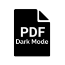

# PDF Dark Mode

Browser Extension for Dark Mode on PDF files to reduce eye strain.

## Background
I had to read through PDFs at night during my exam. I searched for good extensions for dark mode but couldn't find any with custom darkness feature. So built this one.

## How to install?
- Download the ZIP archive
- Extract it
- Follow instructions [here](https://webkul.com/blog/how-to-install-the-unpacked-extension-in-chrome/)

## Inspiration
[DarkPDF](https://github.com/ArshSB/DarkPDF)